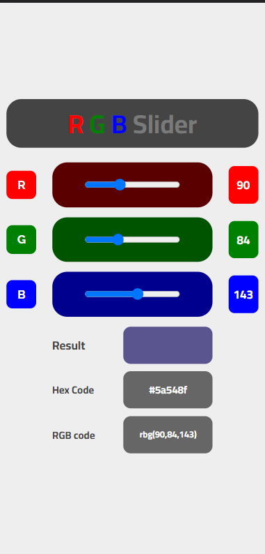
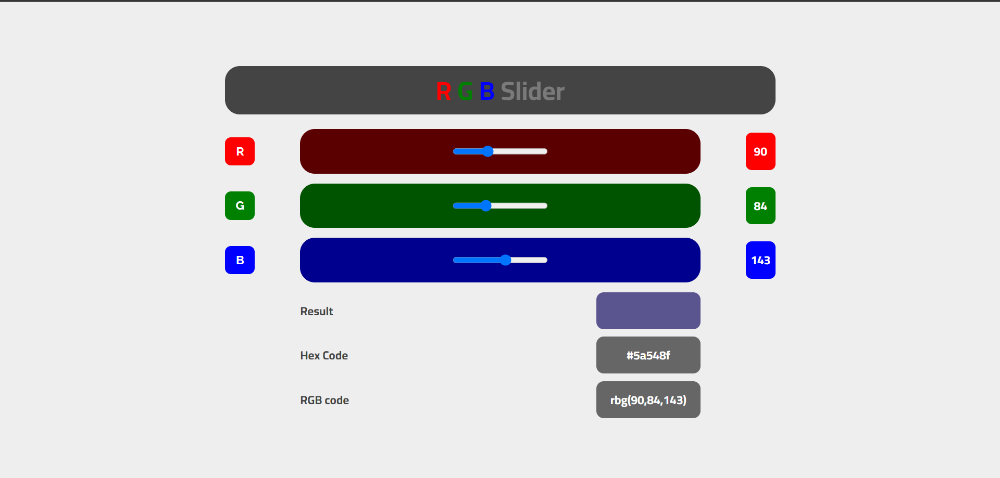

# RGB-Color
RGB Color Website 
## Table of contents
- <a href="#web">Website Screen shot.</a>
- <a href="#how">Built With </a>
- <a href="#what">What I learn</a>
- <a href="#author">Author</a>

### <p id="web">Website Screen shot. </p>
- ***website*** on phone



- ***Website*** on window.
- 

---

### <p id="how">Built with</p> 

- Semantic HTML5 markup
- CSS custom properties
- Flexbox
- CSS Grid
- Mobile-first workflow
- pure js
### <p id="what">What I learn</p>
```js
//    convert decimal number code to hexadecimal number like
    value=255
    hex3=parseInt(value,10).toString(16)
    console.log(hex3)   
```
---
## <p id="author">Author</p>
- <p >Mohamed Yousef</p>

